# Architecture

```mermaid
flowchart LR
    A["OTLP HTTP protobuf or JSON"] --> B["Normalize semantic fields"]
    B --> C["Allow-list redaction"]
    C --> D["Tenant quota and local store"]
    D --> E["Deterministic detectors"]
    E --> F["Versioned classifier match"]
    F --> G["Impact calculation"]
    G --> H["Human issue review"]
    H --> I["Bounded investigation packet"]
    I --> J["Draft handoff"]
    J --> K["Minimized eval candidate"]
    K --> L["Human promotion review"]
    L --> M["Executable test and lineage bundle"]
```

## Components

- `internal/domain`: versioned trace, release, signal, issue, investigation,
  and eval contracts with stable content IDs.
- `internal/corpus`: 5,000 fictional spans, 1,000 runs, eight seeded anomaly or
  drift classes, reviewed truth, secret canaries, and release-context fixtures.
- `internal/ingest`: official OTLP protobuf/JSON decoding, normalization,
  redaction, idempotency, backpressure, and append-only sanitized storage.
- `internal/detect`: deterministic run rules, instrumentation-drift state,
  version/cohort baselines, and minimum-volume frequency changes.
- `internal/reliability`: no-future-data impact calculation, classifier
  evaluation, and human-attributed issue lifecycle.
- `internal/investigate`: release-context routing, capped evidence packets,
  provider-neutral investigation, citation validation, and draft handoffs.
- `internal/evalexport`: minimized identity-free fixtures, content
  deduplication, promotion gates, executable Go tests, and lineage bundles.
- `internal/governance`: tenant admission, retention, deletion receipts, and
  Ed25519-signed report digests.
- `internal/evaluation`: full replay, quality gates, and streaming load probe.

## Authority Model

1. OTLP input is untrusted and cannot bypass sanitization.
2. A signal is deterministic evidence, not a production issue.
3. A cluster cannot activate an issue without a current classifier.
4. A reviewer must confirm an issue with an attributed reason.
5. An investigator sees references only, can abstain, and emits a draft only.
6. Missing, stale, conflicting, or out-of-window release context stops safely.
7. A second reviewer must promote a minimized eval candidate.
8. No component can alter production, page an operator, or roll back a release.

## V1 Limitations

- JSONL fixture storage instead of Parquet/DuckDB or ClickHouse.
- Local HTTP handler library rather than a deployed multi-tenant service.
- Go rule registry rather than user-authored CEL expressions.
- Synthetic reviewed truth and deterministic thresholds.
- In-memory load probe rather than a distributed sustained-load benchmark.
- Local Ed25519 keys rather than workload identity or managed signing keys.
- No live OTLP collector, ticket system, eval registry, or release controller.
